# Dubai Real Estate Automated Valuation Model (AVM)
## 📋 Project Overview

The Dubai Real Estate Automated Valuation Model (AVM) is a sophisticated machine learning system designed to estimate property values in the Dubai real estate market. The project leverages advanced AI algorithms and ensemble learning techniques to provide accurate property valuations for both rental and sales properties.


### Key Features

- 🔄 Comprehensive data preprocessing pipeline
- 🎯 Intelligent feature selection using multiple methods
- 🤖 Multiple base models (XGBoost, Random Forest, SVR)
- 🧠 Neural network-based meta-learner for improved accuracy
- 📊 Detailed evaluation metrics and visualization
- 🐳 Docker containerization for easy deployment

## 🏗️ Project Structure

```
notebooks/
├── preprocess.py          # Data preprocessing pipeline
├── feature_selection.py   # Feature selection logic
├── base_models.py         # Base model implementation
├── meta_learner.py        # Meta-learner implementation
├── main.py               # Orchestrates the entire pipeline
├── evaluation.py         # Model evaluation metrics
├── config.py             # Configuration parameters
├── Dockerfile            # Docker container setup
├── requirements.txt      # Python dependencies
└── test.py              # Unit tests

data/
├── sales.csv        # Sales data
└── rentals.csv      # Rentals data
Dockerfile            # Docker container setup
README.md            # Documentation
```

## 🚀 Getting Started

### Prerequisites

- Python 3.10 or higher
- WSL2 with Ubuntu (for Windows users)
- Docker

### Environment Setup

1. **Install WSL (Windows users)**
```bash
# Update WSL environment
sudo apt update && sudo apt upgrade -y
```

2. **Install Python**
```bash
sudo apt install python3 python3-venv python3-pip -y
```

3. **Install Docker**
```bash
sudo apt install docker-ce docker-ce-cli containerd.io -y
sudo usermod -aG docker $USER
newgrp docker
```

### Installation

1. **Clone the repository**
```bash
git clone <repository-url>
cd dubai-real-estate-avm
```

2. **Set up Python environment**
```bash
python -m venv venv
source venv/bin/activate  # On Windows: venv\Scripts\activate
pip install -r requirements.txt
```

3. **Build Docker container**
```bash
docker build -t avm-app .
```

## 🔧 Usage

### Running with Python

1. **Start the pipeline**
```bash
python main.py
```

### Running with Docker

1. **Run the container**
```bash
docker run -it avm-app
```

## 🧮 Technical Details

### Data Processing Pipeline

The system processes two main types of real estate data:
- Rental Property Data
- Sales Transaction Data

#### Processing Steps:
1. Load raw data (CSV/Parquet)
2. Clean and standardize
3. Handle missing values
4. Process special columns
5. Engineer features
6. Encode categoricals
7. Scale numericals


### Feature Selection

The project employs multiple feature selection techniques:
- Correlation analysis
- Tree-based feature importance
- Recursive feature elimination
- Univariate feature selection
#### Rental Property Feature Importance
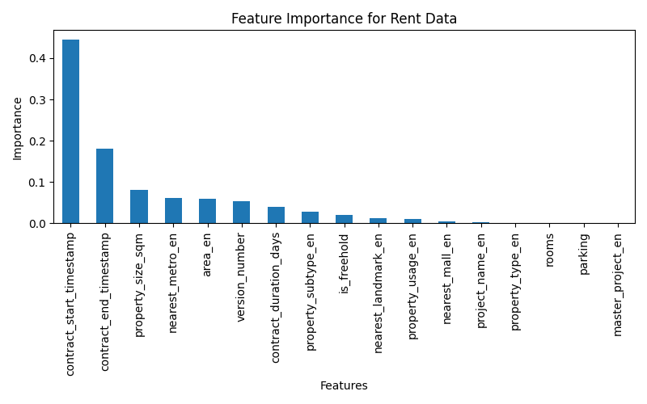
#### Sales Property Feature Importance
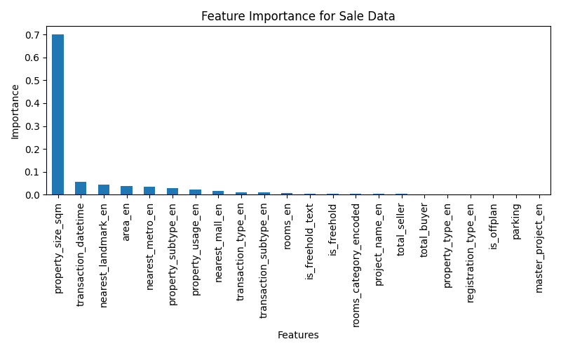

### Model Architecture

#### Base Models:
- XGBoost
- Random Forest
- Support Vector Regression (SVR)

#### Meta-Learner:
- Neural network combining base model predictions
- Optimized using Bayesian optimization

### Evaluation Metrics

- Root Mean Square Error (RMSE)
- R² Score
- Mean Absolute Error (MAE)
- Mean Absolute Percentage Error (MAPE)
- Explained Variance

## 📊 Visualization Examples

### Feature Importance Analysis
#### Rental Property Feature Importance

#### Sales Property Feature Importance


### Optimization Progress

#### Random Forest Optimization Progress
#### Rental Property Optimization Progress

#### Sales Property Optimization Progress

#### XGBoost Optimization Progress
#### Rental Property Optimization Progress
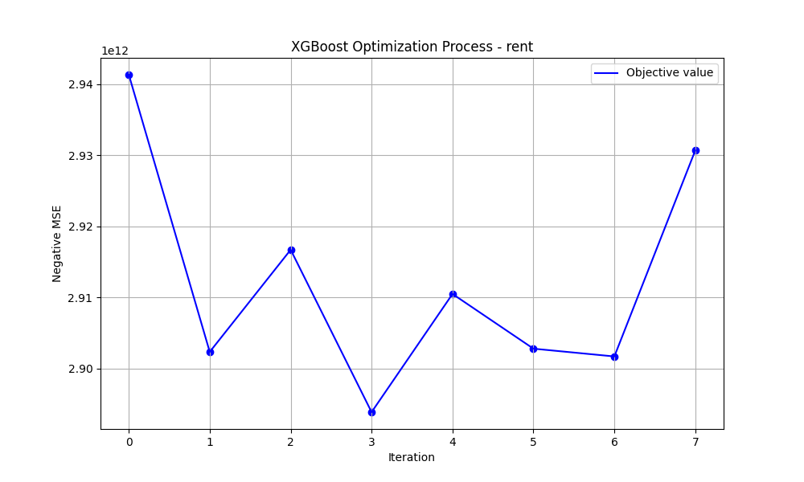
#### Sales Property Optimization Progress
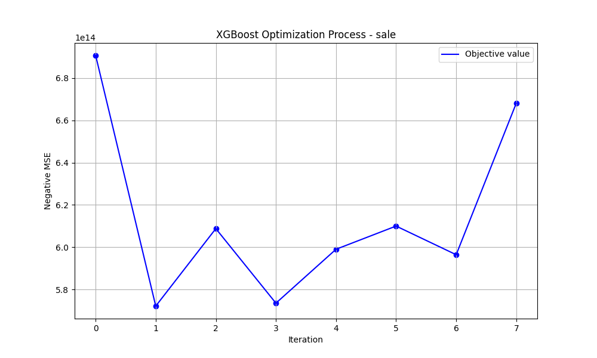
#### SVR Optimization Progress  
#### Rental Property Optimization Progress
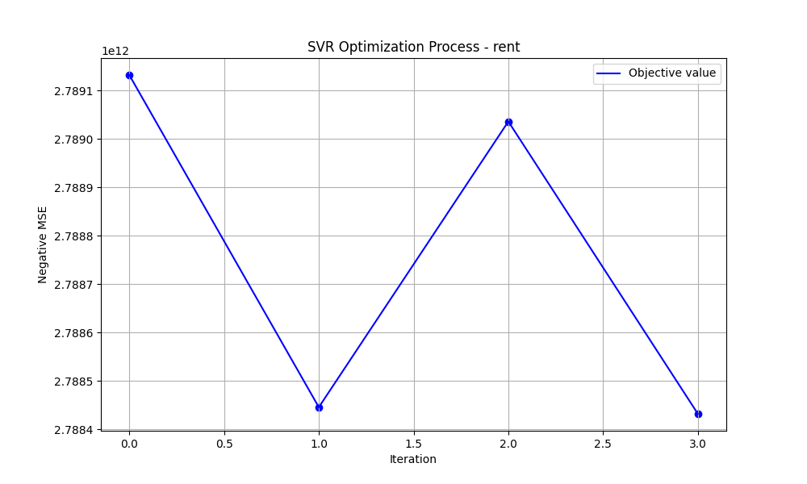
#### Sales Property Optimization Progress
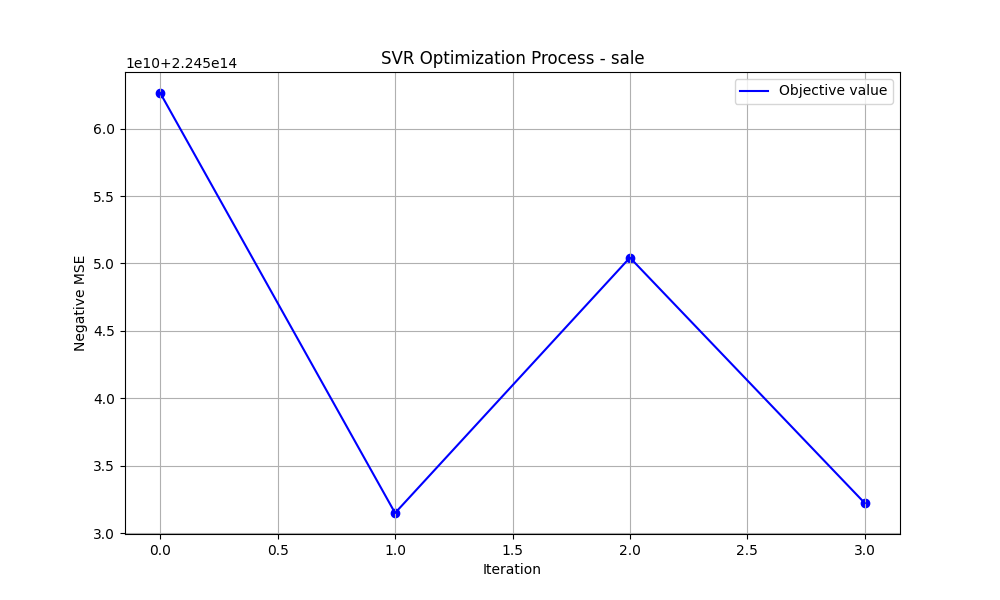
#### Neural Network Optimization Progress
#### Rental Property Optimization Progress
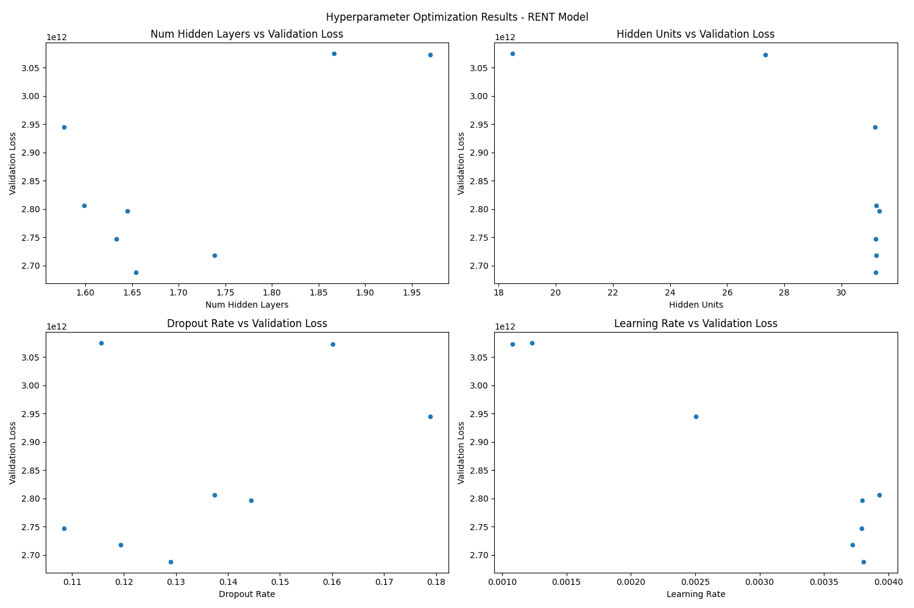
#### Sales Property Optimization Progress
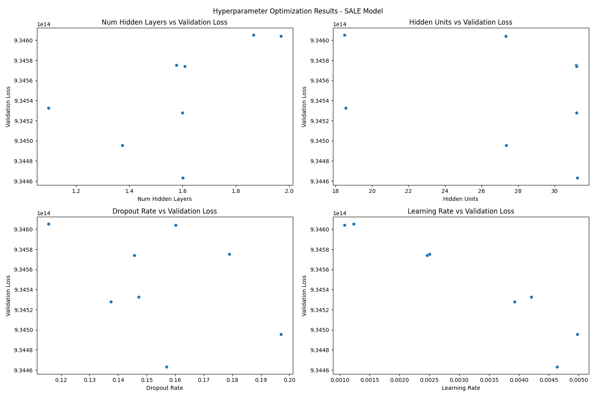


### Residual Analysis
#### Rental Property Residual Analysis
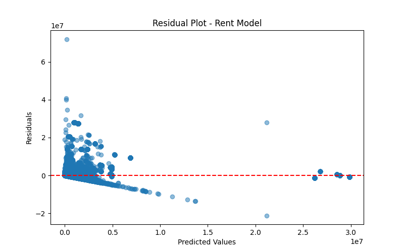
#### Sales Property Residual Analysis
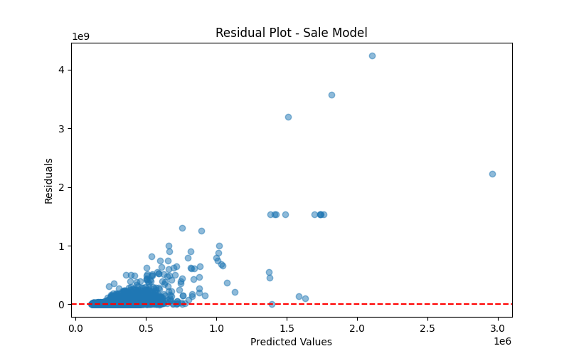

### Actual vs. Predicted Comparison
#### Rental Property Actual vs. Predicted
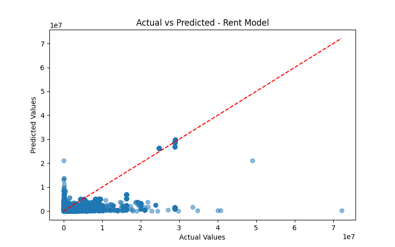
#### Sales Property Actual vs. Predicted
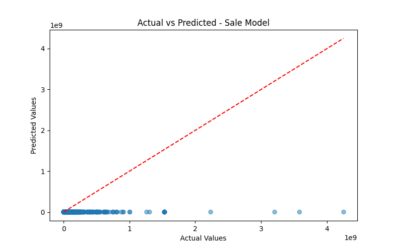

### Training History
#### Rental Property Training History
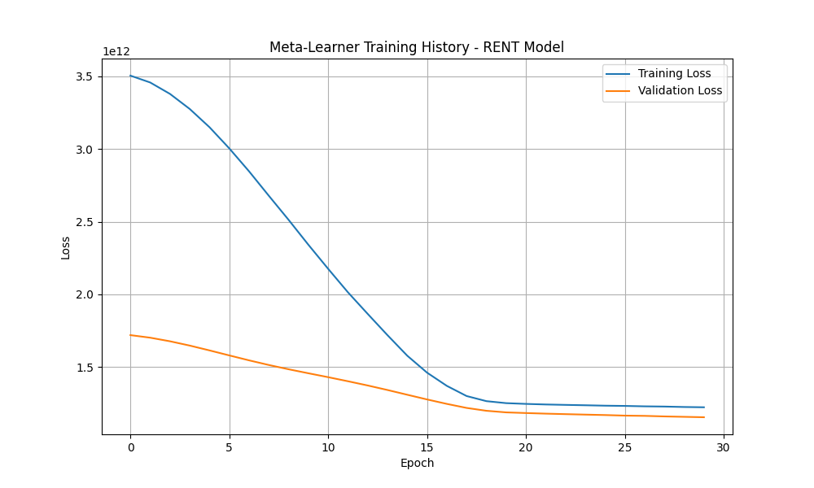
#### Sales Property Training History


## 🧪 Testing

Run the test suite:
```bash
pytest test.py
```

Tests cover:
- Directory setup
- Preprocessing pipeline
- Model training
- Evaluation metrics
- Error handling
- Full pipeline integration

## 📈 Performance

The system achieves competitive performance through:
- Ensemble learning approach
- Hyperparameter optimization
- Feature engineering
- Meta-learning

## ⚙️ Configuration

All major parameters are configurable through `config.py`:
- Data paths
- Model parameters
- Feature selection settings
- Evaluation metrics
- Logging configuration

## 🚧 Error Handling

The system includes comprehensive error handling:
- Detailed logging
- Error tracking
- Exception management
- Data validation


## 📝 License

This project is licensed under the MIT License - see the [LICENSE](LICENSE) file for details.

## 🙋‍♂️ Author

Mahmoud Ayman Kharoof

## 🤝 Acknowledgments

- Smart Bricks for the opportunity
- Dubai Land Department for data insights
- Open-source ML community

---

*This project was developed as part of a technical assessment for Smart Bricks.*